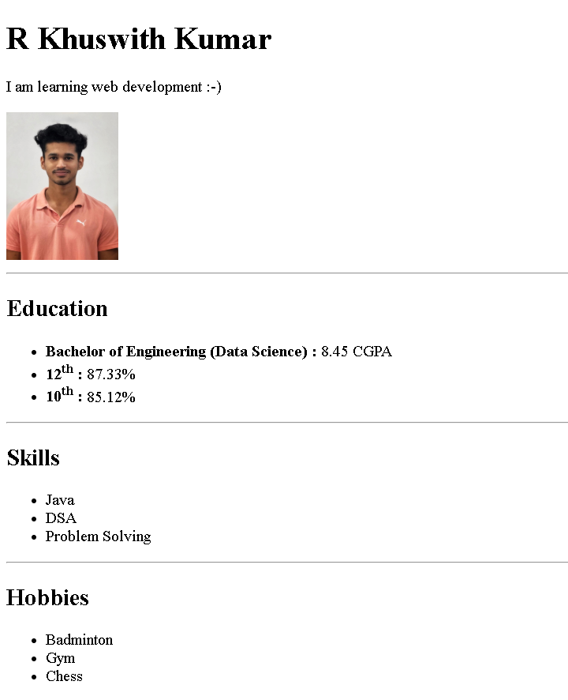

# 🧾 Online Resume (HTML Only)

This project is a simple **online resume** created using only **HTML**.  
It was built as part of my **Web Development journey**, while learning from **Apna College** and **Dr. Angela Yu's Web Development Bootcamp on Udemy**.

---

## 📄 What it Contains

- Personal introduction  
- Education details  
- Hobbies and interests  
- Profile photo  

---

## 🗂️ Folder Structure

```
html-portfolio/
│
├── index.html         # Main HTML resume file
├── Photo.jpg          # Your profile photo
└── screenshot.png     # (Optional) Preview image for this README
```

---

## 🔗 Live Project Link

**GitHub Pages Deployment:**  
👉 [Click here to view the live resume](https://kushwith03.github.io/html-portfolio/)

---

## 📸 Preview Screenshot

> *Note: Make sure `screenshot.png` is present in the root folder.*

<p align="center">
  
</p>

## 🛣️ What's Next?

- ✅ Add CSS for styling and layout  
- ✅ Host on GitHub Pages  
- ✅ Make responsive for all devices 

---

## 📬 Contact Me

- 📧 Email: kushwith03@gmail.com  
- 🔗 LinkedIn: [linkedin.com/in/kushwith03](https://www.linkedin.com/in/kushwith03)  
- 💻 LeetCode: [leetcode.com/u/kushwith_03](https://leetcode.com/u/kushwith_03)

---

> 🚀 *This is one of my first web projects — more polished and interactive ones coming soon!*  

